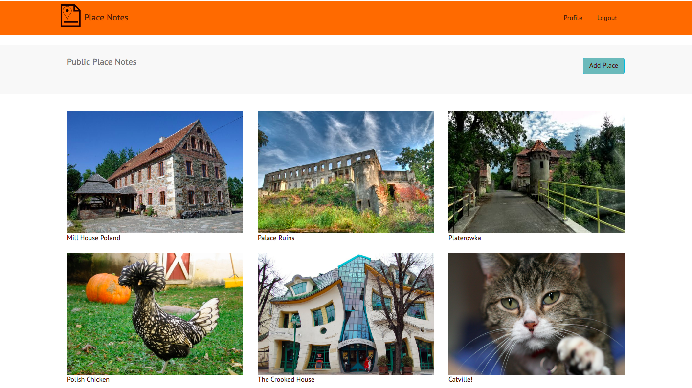

# Place Notes

Place Notes is a travel journal. It is designed to offer a personal experience. It should feel like writing in a diary. It offers the chance to document places you have visited, and to plan out routes and see where you have been.

I have chosen to use the MERN stack; Mongo, Express, React and Node, for this project.

So far I have the basic foundations in place, with the ability to add a note, and view notes on places you have visited. They all have a map visible and the ability to search for the location.

Main next steps will be to add the functionality that allows a publicly visible place to display multiple notes from multiple people, and to specify an author.

Following that, I will be adding the 'route' mapping feature, so that it will be possible to view where you have been on a map, and even follow a route someone else has taken.

